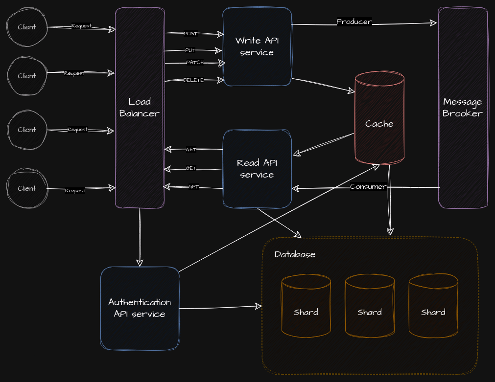

# Twitter Backend
Descripcion de la arquitectura actual.

The main idea of this project is to create a platform with functionality similar to Twitter.
- Users must be able to create users
- Users must be able to follow other users
- Users must be able to post short messages that do not exceed a character limit (in this case 280 characters)
- They must be able to see a timeline showing the tweets of the users they follow
- The solution must be able to scale
- The application has to be optimized for reading

## Architecture

### Current implementation:

Description of the current architecture.


The system will use PostgreSQL as a database and will consist of three services:
* Auth: which will be in charge of managing the user.
* Tweet: which will be in charge of managing tweets, likes, and retweets, whether to create or delete them.
* Timeline: is in charge of managing the timeline that users will see.

#### Tweet service endpoints:

* GET /helthz - check service status
* GET /id/{id} - get a tweet by its ID
* POST /create - create a tweet
* DELETE /delete/{id} - delete a tweet
* POST /like - like a tweet
* DELETE /like - remove a like from a tweet
* POST /retweet - retweet a tweet
* DELETE /retweet - remove a retweet

#### Auth service endpoints:

* GET /helthz - check service status
* POST /create - create a user
* GET /id/{id} - get a user by ID
* GET /name/{name} - get a user by name
* DELETE /delete/{id} - delete a user
* POST /follow - follow a user
* DELETE /unfollow - stop following a user
* PATCH /update - update user data

#### Timeline:
* GET /healthz - check service status
* GET /timeline - get the timeline of tweets from users I follow
* GET /update - update the timeline with the latest tweets

`Timeline` will return n tweets from an ID of the last n tweets
`Update` will return new n tweets from the last ID (or timestamp)

They run behind a reverse proxy (Nginx)

This infrastructure runs on Docker Compose, at the moment it is not implemented, but it should have a cache that could be Redis or Memcached and a message broker, the most popular could be Kafka but I am going to use Nats for the implementation of the timeline.

### Future Implementation



We have to think that in general for this type of system, the biggest bottleneck and single point of failure is usually our database, so we should think about using strategies such as:
Database sharding, Leader-based replication, graph database

We could also think about dividing our services into the APIs that write to our database and those that read. Our load balancer could be in charge of handling user authentication, and with our message broker and reading services we can handle push notifications. This section is open to more ideas, such as implementing something as important as a CI/CD workflow (Github Action or Argo CD)

We can also think about running this type of infrastructure in Kubernetes with a provider such as AWS or Azure. Although for a social network of this size, it is likely that we will have our servers and that the DevOps team will manage our clusters, perhaps using IaC (such as Terraform or Pulumi)

#### More tools to use

* OAuth: [OAuth2 Proxy](https://github.com/oauth2-proxy/oauth2-proxy)
* [CI/CD](https://docs.github.com/en/actions): Github Actions
* [Ginkgo](https://github.com/onsi/ginkgo): for integration test
* [Gherkin](https://cucumber.io/docs/gherkin/): for E2E test
* [PI documentation](https://swagger.io/): OpenAPI - Swagger
* Tracing: [OpenTelemetry](https://github.com/open-telemetry/opentelemetry-go) and [Jaeger](https://www.jaegertracing.io/)
* Loggin: Elasticsearch and [Kibana](https://www.elastic.co/kibana)
* Monitoring: [Grafana](https://grafana.com/) and [Prometheus](https://prometheus.io/)
* Container Orchestration: [Kubernetes](https://kubernetes.io/)
* Infrastructure as code: [Terraform](https://www.terraform.io/)

### Docker Compose Architecture


### Run the project

You can run the project using Docker Compose.

```bash
docker compose up --build
```

And after that run the following command to update the database schema:

```bash
make run/migration
```

Here  you can read more data about the project.

Also, you have some useful commands with `make` you can the detail running `make help`
