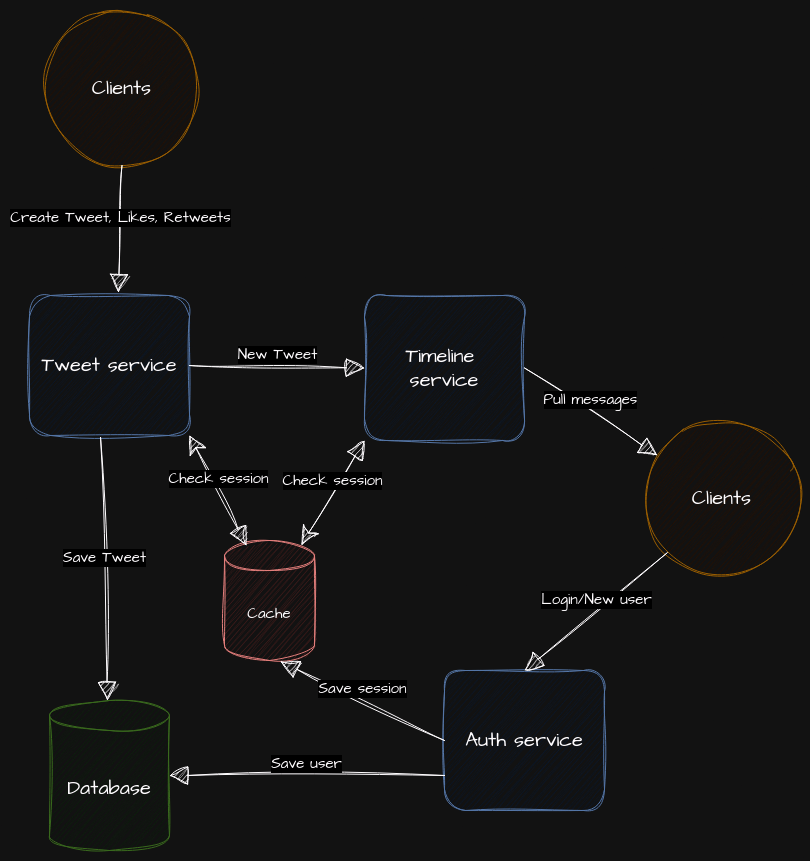
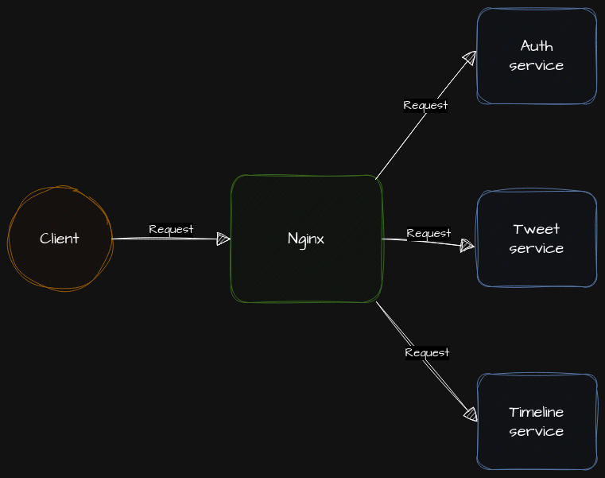

# Twitter Backend

## Architecture



### Docker Compose



### Run the project

You can run all the project using Docker compose.

```bash
docker compose up --build
```

Also you have some usefully commands with `make` you can the detail running `make help`
